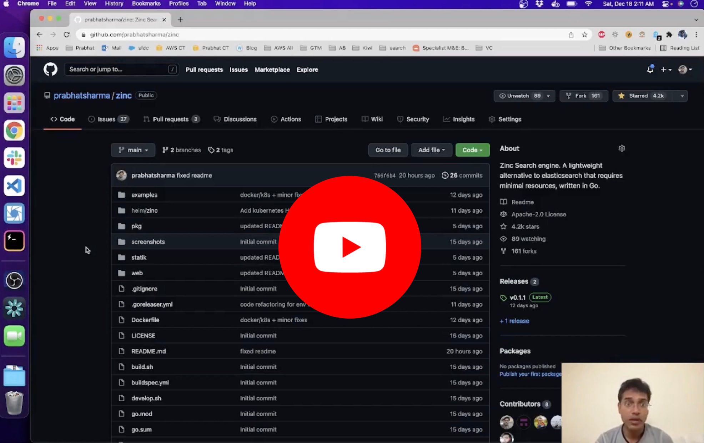
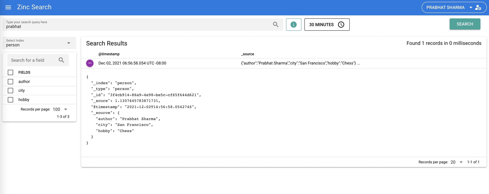
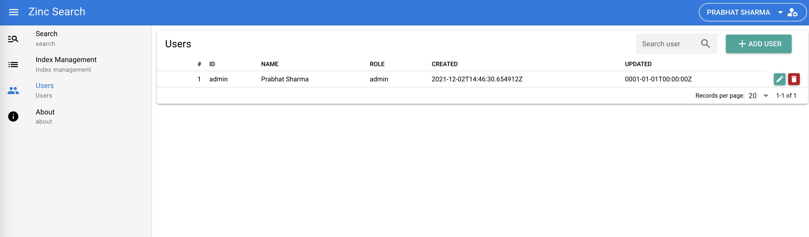
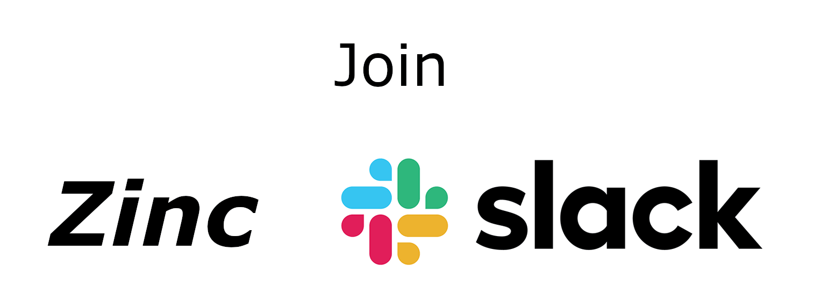

 

❗Note: If your use case is of log search (app and security logs) instead of app search (implement search feature in your application or website) then you should check [zinclabs/zincobserve](https://github.com/zinclabs/zincobserve) project built in rust that is specifically built for log search use case.
# ZincSearch

ZincSearch is a search engine that does full text indexing. It is a lightweight alternative to Elasticsearch and runs using a fraction of the resources. It uses [bluge](https://github.com/blugelabs/bluge) as the underlying indexing library.

It is very simple and easy to operate as opposed to Elasticsearch which requires a couple dozen knobs to understand and tune which you can get up and running in 2 minutes

It is a drop-in replacement for Elasticsearch if you are just ingesting data using APIs and searching using kibana (Kibana is not supported with ZincSearch. ZincSearch provides its own UI).

Check the below video for a quick demo of ZincSearch.

# Why ZincSearch

  While Elasticsearch is a very good product, it is complex and requires lots of resources and is more than a decade old. I built ZincSearch so it becomes easier for folks to use full text search indexing without doing a lot of work.

# Features:

1. Provides full text indexing capability
2. Single binary for installation and running. Binaries available under releases for multiple platforms.
3. Web UI for querying data written in Vue
4. Compatibility with Elasticsearch APIs for ingestion of data (single record and bulk API)
5. Out of the box authentication
6. Schema less - No need to define schema upfront and different documents in the same index can have different fields.
7. Index storage in disk
8. aggregation support

# Documentation

Documentation is available at [https://zincsearch-docs.zinc.dev/](https://zincsearch-docs.zinc.dev/)

# How to get support

Easiest way to get support is to join the [Slack channel](https://join.slack.com/t/zincsearch/shared_invite/zt-11r96hv2b-UwxUILuSJ1duzl_6mhJwVg).

# Screenshots

## Search screen

## User management screen

# Getting started

## Quickstart

Check [Quickstart](https://zincsearch-docs.zinc.dev/quickstart/)

# Releases

ZincSearch has hundreds of production installations is in GA.

# ZincSearch Vs ZincObserve

| Feature             | ZincSearch     |   ZincObserve                |
----------------------|-----------|-----------------------------------|
| Ideal use case      | App search| Logs, metrics, traces (Immutable Data)  | 
| Storage             | Disk      |  Disk, Object (S3), GCS, MinIO, swift and more.   |
| Preferred Use case  | App search | Observability (Logs, metrics, traces) |
| Max  data supported | 100s of GBs | Petabyte scale |
| High availability   | Not available | Yes |
| Open source         | Yes | Yes, [ZincObserve](https://github.com/zinclabs/zincobserve)  |
| ES API compatibility| Yes | Yes | 
| GUI                 | Basic     | Very Advanced, including dashboards |
| Cost                | Open source | Open source| 
| Get started         | [Open source docs](https://zincsearch-docs.zinc.dev/quickstart/) | [Open source docs](https://docs.zinc.dev/quickstart) or [Cloud](https://observe.zinc.dev) |

# Community

- How to develop and contribute to ZincSearch

  Check the [contributing guide](./CONTRIBUTING.md) . Also check the [roadmap items](https://github.com/orgs/zinclabs/projects/3)

- Join our Slack Channel

  

- Join our weChat Group

  
