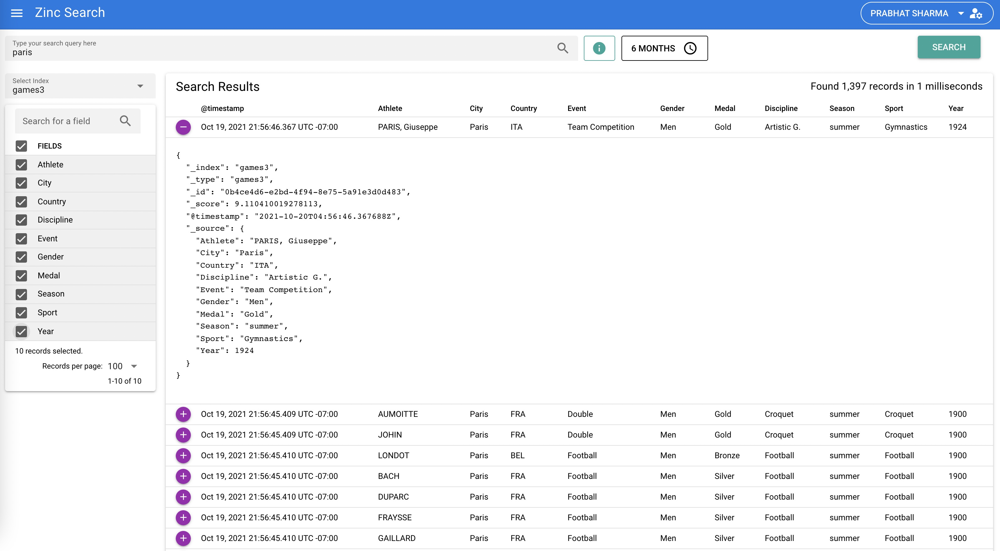

Note: Zinc and all its APIs are considered to be alpha stage at this time. Expect breaking changes in API contracts and data format at this stage.
# Zinc Search Engine

Zinc is a search engine that does full text indexing. It is a lightweight alternative to Elasticsearch and runs using a fraction of the resources. It uses [bluge](https://github.com/blugelabs/bluge) as the underlying indexing library.

It is very simple and easy to operate as opposed to Elasticsearch which requires a couple dozen knobs to understand and tune. 

It is a drop-in replacement for Elasticsearch if you are just ingesting data using APIs and searching using kibana (Kibana is not supported with zinc. Zinc provides its own UI).

Check the below video for a quick demo of Zinc.

Join slack channel

# Why zinc

  While Elasticsearch is a very good product, it is complex and requires lots of resources and is more than a decade old. I built Zinc so it becomes easier for folks to use full text search indexing without doing a lot of work.

# Features:

1. Provides full text indexing capability
2. Single binary for installation and running. Binaries available under releases for multiple platforms.
3. Web UI for querying data written in Vue
4. Compatibility with Elasticsearch APIs for ingestion of data (single record and bulk API)
5. Out of the box authentication
6. Schema less - No need to define schema upfront and different documents in the same index can have different fields.
7. Index storage in s3 and minio (experimental)
8. aggregation support

# Roadmap items:
1. High Availability
1. Distributed reads and writes
1. Geosptial search
1. Raise an issue if you are looking for something.

# Screenshots

## Search screen

## User management screen

# Getting started

## Download / Installation / Run

Check installation [installation docs](https://docs.zinclabs.io/04_installation/)

## Data ingestion

### Single record

Check [single record ingestion docs](https://docs.zinclabs.io/ingestion/single-record/)

### Bulk ingestion

Check [bulk ingestion docs](https://docs.zinclabs.io/ingestion/bulk-ingestion/#bulk-ingestion)

### Fluent bit

Check [fluet-bit ingestion docs](https://docs.zinclabs.io/ingestion/fluent-bit/)

### Syslog-ng

Check [syslog-ng ingestion docs](https://docs.zinclabs.io/ingestion/syslog-ng/)

## API Reference

Check [Zinc API docs](https://docs.zinclabs.io/API%20Reference/)

# How to develop and contribute to Zinc

Check the [contributing guide](./CONTRIBUTING.md)

# Who uses Zinc (Known users)?

1. [Quadrantsec](https://quadrantsec.com/)

Please do raise a PR adding your details if you are using Zinc.

