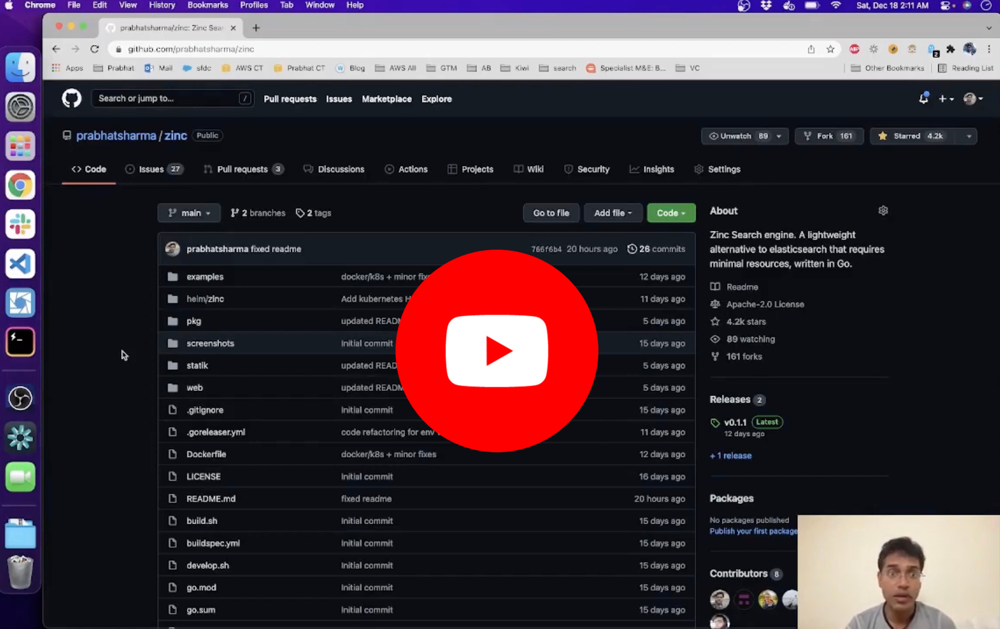
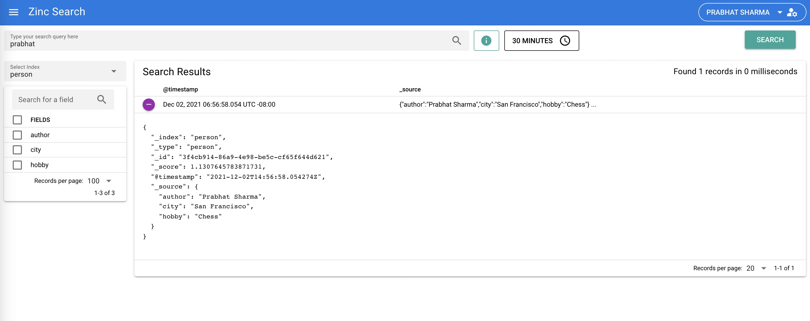
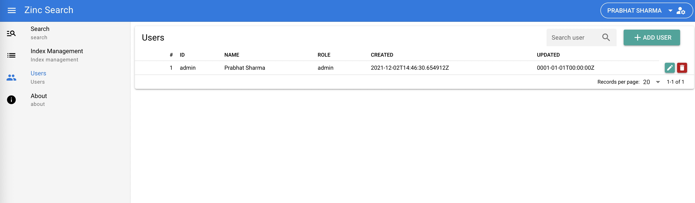

[](https://github.com/zincsearch/zincsearch/actions/workflows/ci.yml)
[](https://github.com/zincsearch/zincsearch/actions/workflows/nightly.yml)
[](https://github.com/zincsearch/zincsearch/actions/workflows/release.yml)
[](https://pkg.go.dev/github.com/zincsearch/zincsearch)
[](./go.mod)
[](https://golangci-lint.run/)
[](https://github.com/zincsearch/zincsearch/releases/latest)
[](https://zincsearch-docs.zinc.dev/) [](https://codecov.io/github/zincsearch/zincsearch)

❗Note: If your use case is of log search (app and security logs) instead of app search (implement search feature in your application or website) then you should check [openobserve/openobserve](https://github.com/openobserve/openobserve) project built in rust that is specifically built for log search use case.

# ZincSearch

ZincSearch is a search engine that does full text indexing. It is a lightweight alternative to Elasticsearch and runs using a fraction of the resources. It uses [bluge](https://github.com/blugelabs/bluge) (via the [vcaesar/riot](https://github.com/vcaesar/riot) fork) as the underlying indexing library.

It is very simple and easy to operate as opposed to Elasticsearch which requires a couple dozen knobs to understand and tune. You can get ZincSearch up and running in 2 minutes.

It is a drop-in replacement for Elasticsearch if you are just ingesting data using APIs and searching using kibana (Kibana is not supported with ZincSearch. ZincSearch provides its own UI).

Check the below video for a quick demo of ZincSearch.

[](https://www.youtube.com/watch?v=aZXtuVjt1ow)

# Why ZincSearch

While Elasticsearch is a very good product, it is complex and requires lots of resources and is more than a decade old. I built ZincSearch so it becomes easier for folks to use full text search indexing without doing a lot of work.

# Features:

go + gin + react

1. Provides full text indexing capability
2. Single binary for installation and running. Binaries available under releases for multiple platforms.
3. Web UI for querying data written in React (embedded in the binary)
4. Compatibility with Elasticsearch APIs for ingestion of data (single record and bulk API)
5. Out of the box authentication
6. Schema less - No need to define schema upfront and different documents in the same index can have different fields.
7. Index storage in disk
8. aggregation support

# Documentation

Documentation is available at [https://zincsearch-docs.zinc.dev/](https://zincsearch-docs.zinc.dev/)

# Screenshots

## Search screen



## User management screen



# Getting started

## Quickstart

Check [Quickstart](https://zincsearch-docs.zinc.dev/quickstart/)

# Releases

ZincSearch has hundreds of production installations.

## Build

- CI (lint, `go test` on Linux/macOS/Windows, coverage): [`.github/workflows/ci.yml`](./.github/workflows/ci.yml) → https://github.com/zincsearch/zincsearch/actions/workflows/ci.yml
- Nightly dev image `ghcr.io/zincsearch/zincsearch-dev:nightly`: [`.github/workflows/nightly.yml`](./.github/workflows/nightly.yml) → https://github.com/zincsearch/zincsearch/actions/workflows/nightly.yml
- Release (`v*` tags, goreleaser, `ghcr.io/zincsearch/zincsearch`): [`.github/workflows/release.yml`](./.github/workflows/release.yml) → https://github.com/zincsearch/zincsearch/actions/workflows/release.yml

> **Note — Nightly / dev-image (push) fails on forks:**
>
> ```
> Error: buildx failed with: ERROR: failed to build: failed to solve: failed to push ghcr.io/zincsearch/zincsearch-dev:0.4.11-8792c59-dev: denied: permission_denied: The requested installation does not exist.
> ```
>
> The workflow logs in to GHCR with the repository's `GITHUB_TOKEN`, which can only push packages under the
> owner of the repository running the workflow. On a fork the token has no access to the `zincsearch` org, so
> the push is denied. Either run the workflow from `zincsearch/zincsearch`, or change `env.IMAGE` in
> `nightly.yml` to `ghcr.io/<your-owner>/zincsearch-dev` (and make sure the package is linked to the repo /
> the repo has `packages: write`).

# ZincSearch Vs OpenObserve

| Feature              | ZincSearch                                                       | OpenObserve                                                                              |
| -------------------- | ---------------------------------------------------------------- | ---------------------------------------------------------------------------------------- |
| Ideal use case       | App search                                                       | Logs, metrics, traces (Immutable Data)                                                   |
| Storage              | Disk                                                             | Disk, Object (S3), GCS, MinIO, swift and more.                                           |
| Preferred Use case   | App search                                                       | Observability (Logs, metrics, traces)                                                    |
| Max data supported   | 100s of GBs                                                      | Petabyte scale                                                                           |
| High availability    | Not available                                                    | Yes                                                                                      |
| Open source          | Yes                                                              | Yes, [OpenObserve](https://github.com/openobserve/openobserve)                           |
| ES API compatibility | Yes                                                              | Yes                                                                                      |
| GUI                  | Basic                                                            | Very Advanced, including dashboards                                                      |
| Cost                 | Open source                                                      | Open source                                                                              |
| Get started          | [Open source docs](https://zincsearch-docs.zinc.dev/quickstart/) | [Open source docs](https://openobserve.ai/docs) or [Cloud](https://cloud.openobserve.ai) |

# Community

- How to develop and contribute to ZincSearch

  Check the [contributing guide](./CONTRIBUTING.md). Also check the [roadmap](https://zincsearch-docs.zinc.dev/roadmap/)

# Examples

You can use ZincSearch to index and search any data. Here are some examples that folks have created to index and search enron email dataset using zincsearch:

1. https://github.com/jorgeloaiza48/Enron-Email-DataSet
1. https://github.com/jhojanperlaza/email_search_engine
1. https://github.com/carlosarraes/zinmail
1. https://github.com/devjopa/golab-search
1. https://github.com/avaco2312/zincsearch
1. https://github.com/paolorossig/email-indexer
1. https://github.com/ulimonte05/zincsearching
